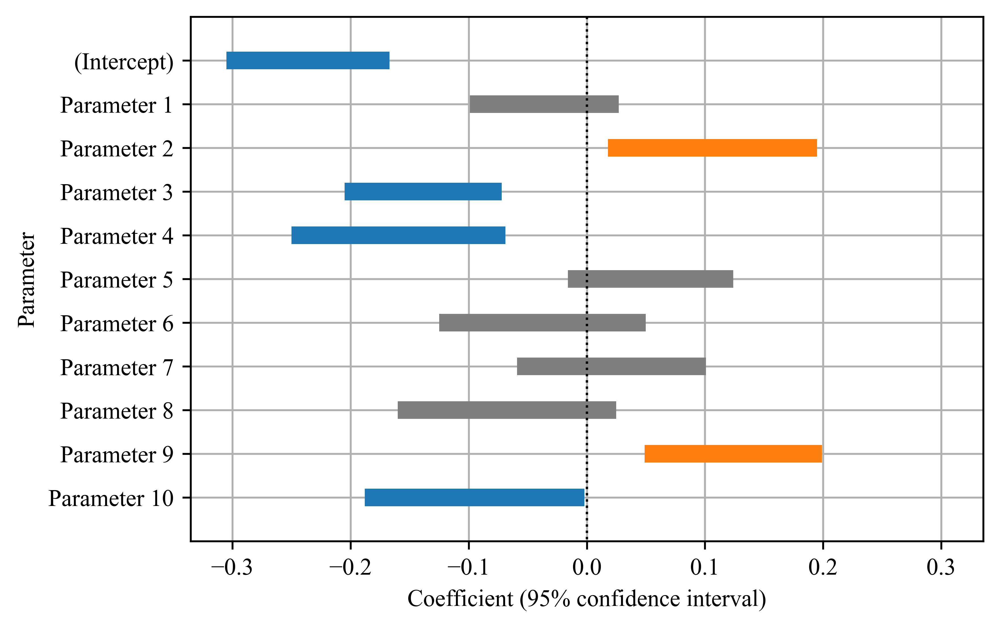

# PlotCoefficients
Plot 95% confidence interval

  

## Environment
```
Python 3.7.6
Platform: x86_64-apple-darwin17.0 (64-bit)
Running under: macOS Catalina 10.15.7
```

## Files
- PlotCoefficients.py  
- sampledata.csv  
- plot_sampledata.png
